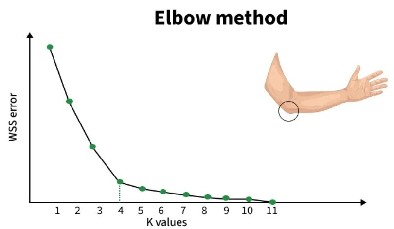

# Clustering

Clustering algorithms group data points i
nto clusters based on their similarities or differences.

https://www.geeksforgeeks.org/machine-learning/machine-learning/

### K-means Clustering

Works by grouping points based on distance to cluster centers.
Commonly used in customer segmentation, image compression and pattern discovery.

**K** represents the number of groups or clusters we want to classify our items into.

- Initialization: We begin by randomly selecting k cluster centroids.
- Assignment Step: Each data point is assigned to the nearest centroid, forming clusters.
- Update Step: After the assignment, we recalculate the centroid of each cluster by averaging the points within it.
- Repeat: This process repeats until the centroids no longer change or the maximum number of iterations is reached.

The goal is to partition the dataset into k clusters such that data points within each cluster are more similar to each
other than to those in other clusters.

### Uses of K-Means Clustering

- Data Segmentation: One of the most common uses of K-Means is segmenting data into distinct groups. For example,
  businesses use K-Means to group customers based on behavior, such as purchasing patterns or website interaction.
- Image Compression: K-Means can be used to reduce the complexity of images by grouping similar pixels into clusters,
  effectively compressing the image. This is useful for image storage and processing.
- Anomaly Detection: K-Means can be applied to detect anomalies or outliers by identifying data points that do not
  belong to any of the clusters.
- Document Clustering: In natural language processing (NLP), K-Means is used to group similar documents or articles
  together. It’s often used in applications like recommendation systems or news categorization.
- Organizing Large Datasets: When dealing with large datasets, K-Means can help in organizing the data into smaller,
  more manageable chunks based on similarities, improving the efficiency of data analysis.

### Challenges with K-Means Clustering

- One of the biggest challenges is deciding how many clusters to use.
- The final clusters can vary depending on the initial random placement of centroids.
- K-Means assumes that the clusters are spherical and equally sized. This can be a problem when the actual clusters in
  the data are of different shapes or densities.
- K-Means is sensitive to outliers, which can distort the centroid and, ultimately, the clusters.

### Elbow Method for optimal value of k in KMeans

The Elbow Method is used to find the optimal number of clusters (k) in K-Means by analyzing how the clustering
performance changes with different k values.

WCSS: Within-Cluster Sum of Squares

- Before the elbow: WCSS drops quickly -> clusters become much better.
- After the elbow: WCSS drops slowly -> extra clusters add little value and may lead to overfitting.

**Distortion** measures the average squared distance between each data point and its assigned cluster center. It's a
measure of how well the clusters represent the data. A lower distortion value indicates better clustering.

**Inertia** is the sum of squared distances of each data point to its closest cluster center. It's essentially the total
squared error of the clustering. Like distortion, a lower inertia value suggests better clustering.

### K-means++ Algorithm

Clustering is used to group similar data points. K-Means is a commonly used clustering method, but it often gives poor
results because the initial cluster centers are chosen randomly.
This may lead to empty clusters, overlapping clusters or centroids falling too close to each other.

Instead of picking all centroids randomly, it chooses the first center randomly and then selects the remaining centers
in a spaced-out manner.

1. First center: Choose the first cluster center uniformly at random from the data points
2. Subsequent centers: For each remaining center:
    - Calculate the distance from each data point to its nearest existing center.
    - Choose the next center with probability proportional to the square of this distance.
    - Points farther from existing centers have a higher chance of being selected.
3. Standard K-means: Once all k centers are initialized, proceed with the standard K-means algorithm

### Uses of K-Means++ Clustering

- Image segmentation: Divides images into regions based on color or texture, useful for tasks like object recognition
  and tracking.
- Customer segmentation: Groups customers based on behavior or demographics to improve targeted marketing and
  advertising.
- Recommender systems: Suggests products or services using user preferences and past data, commonly used in e-commerce
  platforms.
