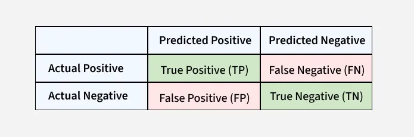

# Confusion Matrix

- True Positive (TP): The model correctly predicted a positive outcome i.e the actual outcome was positive.
- True Negative (TN): The model correctly predicted a negative outcome i.e the actual outcome was negative.
- False Positive (FP): The model incorrectly predicted a positive outcome i.e the actual outcome was negative. It is
  also known as a Type I error.
- False Negative (FN): The model incorrectly predicted a negative outcome i.e the actual outcome was positive. It is
  also known as a Type II error.

https://www.geeksforgeeks.org/machine-learning/confusion-matrix-machine-learning/

### Bank loan approval example

Positive class: Customer will default

Negative class: Customer will not default

- True Positive (TP): A risky customer is correctly identified as risky
- True Negative (TN): A safe customer is correctly identified as safe
- False Negative (FN): A risky customer is wrongly classified as safe
- False Positive (FP): A safe customer is wrongly classified as risky

### Recall (Sensitivity)

Low sensitivity is dangerous in finance.

Because:
False Negatives (FN) mean high-risk customers getting loans.
This leads to bad debt and financial loss.

### Specificity

Specificity answers the question: Of all the actual negative cases, how many did the model successfully identify as
negative? It is the negative equivalent of Recall.

Protecting Good Customers: Out of all customers who are actually safe, how many did the model correctly approve?
