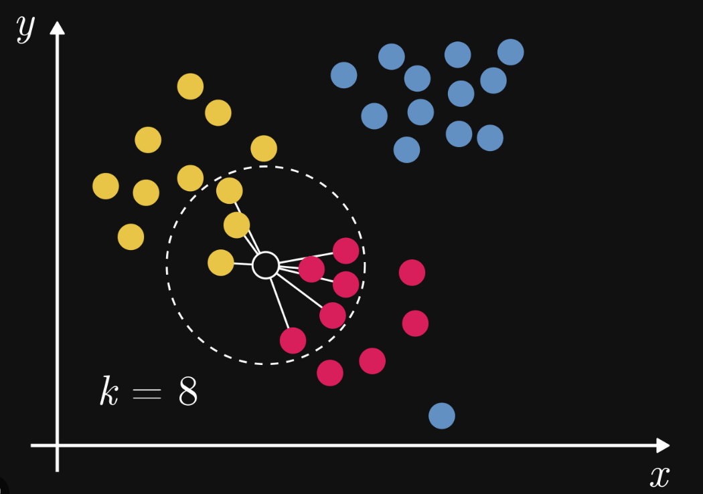

# K-Nearest Neighbors

K‑Nearest Neighbor (KNN) is a simple and widely used machine learning technique for classification and regression tasks.

It works by identifying the K closest data points to a given input and making predictions based on the 
majority class or average value of those neighbors.

- Classifies data based on similarity with nearby data points
- Uses distance metrics like Euclidean distance to find nearest neighbors
- No training
- Choosing the right k is important for good results
- If k is too large the model may become too simple and miss important patterns and this is called underfitting
- Cross-Validation is a good way to find the best value of k is by using k-fold cross-validation

Distance Metrics Used in KNN Algorithm:
- Euclidean Distance
- Manhattan Distance
- Minkowski Distance

