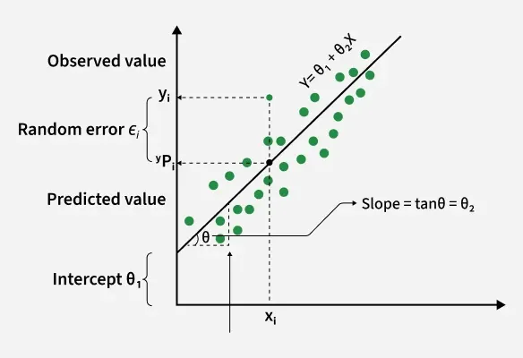
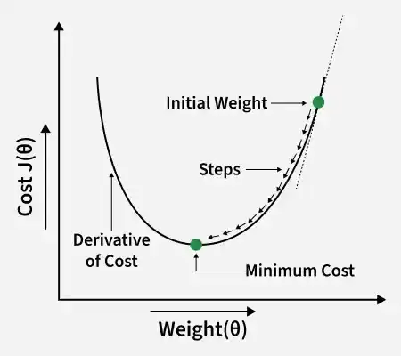

# Linear Regression

Linear Regression is a fundamental supervised learning algorithm used to model the relationship
between a dependent variable (label) and one or more independent variables (features).
It predicts continuous values by fitting a straight line that best represents the data.

In linear regression, the **best-fit line** is the straight line that best represents the relationship
between the independent variable (input) and the dependent variable (output).
The goal is to minimize the difference between the actual data points and the predicted values generated by the model.

The best-fit line is represented by the equation: **y=mx+b**

### Cost Function

In Linear Regression, the cost function measures how far the predicted values (Y') are from the actual values (Y).
It helps identify and reduce errors to find the best-fit line.
The most common cost function used is **Mean Squared Error** (MSE),
which calculates the average of squared differences between actual and predicted values.

### Gradient Descent

Gradient descent is an optimization technique used to train a linear regression model by minimizing the prediction
error. It works by starting with random model parameters and repeatedly adjusting them to reduce the difference
between predicted and actual values.

How it works:

- Start with random values for slope and intercept.
- Calculate the error between predicted and actual values.
- Find how much each parameter contributes to the error (gradient).
- Update the parameters in the direction that reduces the error.
- Repeat until the error is as small as possible.

This helps the model find the best-fit line for the data.

### Evaluation Metrics

A variety of evaluation measures can be used to determine the strength of any linear regression model.
These assessment metrics often give an indication of how well the model is producing the observed outputs.

- Mean Squared Error (MSE)
- Mean Absolute Error (MAE)
- Root Mean Squared Error (RMSE): Square root of the residuals variance is RMSE.
  It describes how well the observed data points match the expected values or the model's absolute fit to the data.
- R-Squared: Indicates how much variation the model explains. Its value is typically between 0 and 1, but it can be
  negative if the model performs worse than a simple baseline model.

### Regularization Techniques

- Lasso Regression: Regularizes a linear regression model, it adds a penalty term to the linear regression objective
  function to prevent overfitting.
- Ridge regression
- Elastic Net Regression: Hybrid regularization technique that combines the power of both L1 and L2 regularization in
  linear regression objective.
