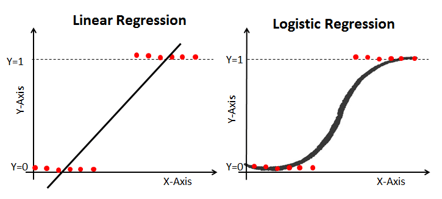
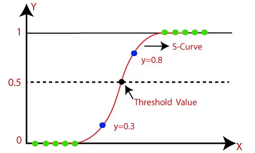
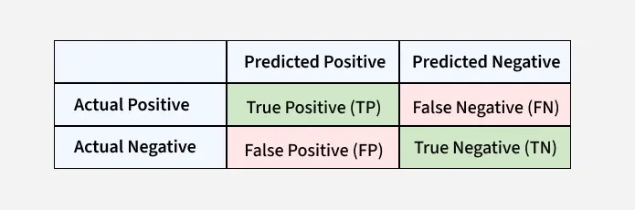

# Logistic Regression

Logistic Regression is a supervised machine learning algorithm used for classification problems. 
It predicts the probability that an input belongs to a specific class.

It is used for binary classification where the output can be one of two possible categories such as Yes/No, 
True/False or 0/1. It uses sigmoid function to convert inputs into a probability value between 0 and 1.

In **binomial logistic regression**, the target variable can only have two possible values such as "0" or "1", 
"pass" or "fail". The sigmoid function is used for prediction.

**Multinomial Logistic Regression**:
Target variable can have 3 or more possible types which are not ordered i.e types have no quantitative significance 
like “disease A” vs “disease B” vs “disease C”.
In this case, the softmax function is used in place of the sigmoid function.

### Metrics

Some of the most common metrics include:

- Accuracy
- Precision
- Recall
- F1-score
- ROC-AUC Curve

### Confusion Matrix

- True Positive (TP): The model correctly predicted a positive outcome i.e the actual outcome was positive.
- True Negative (TN): The model correctly predicted a negative outcome i.e the actual outcome was negative.
- False Positive (FP): The model incorrectly predicted a positive outcome i.e the actual outcome was negative. It is also known as a Type I error.
- False Negative (FN): The model incorrectly predicted a negative outcome i.e the actual outcome was positive. It is also known as a Type II error.

https://www.geeksforgeeks.org/machine-learning/confusion-matrix-machine-learning/

