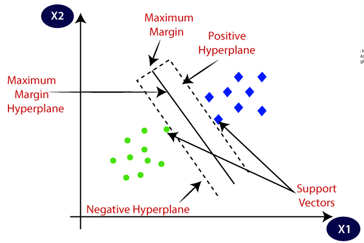
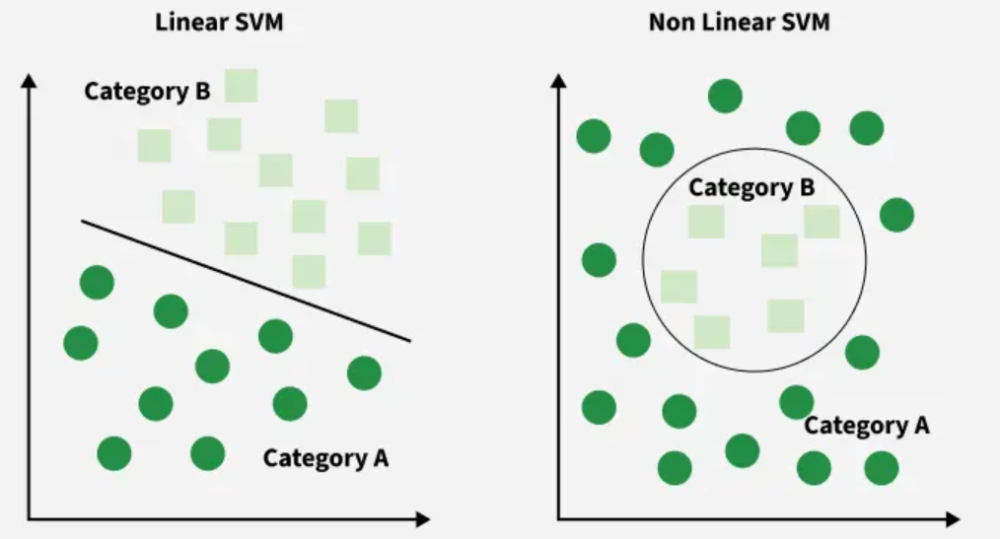
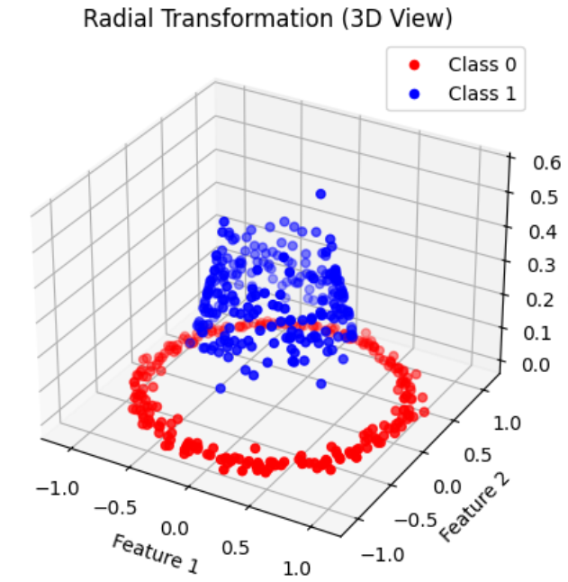

# Support Vector Machine

(SVM)

Support Vector Machine (SVM) is a supervised machine learning algorithm used for classification and regression tasks.
It tries to find the best boundary known as hyperplane that separates different classes in the data.

SVMs mostly used for linear classification purposes.

Key Concepts:

- Hyperplane: A decision boundary separating different classes
- Support Vectors: The closest data points to the hyperplane
- Margin: The distance between the hyperplane and the support vectors
- Kernel: A function that maps data to a higher-dimensional space enabling SVM to handle non-linearly separable data.
- Hard Margin: A maximum-margin hyperplane that perfectly separates the data without misclassifications.
- Soft Margin: Allows some misclassifications

The key idea behind the SVM algorithm is to find the hyperplane that best separates two classes by maximizing the margin
between them.

When data is not linearly separable, it can't be divided by a straight line, SVM uses a technique called kernels to
map the data into a higher-dimensional space where it becomes separable.

### Linear SVM

- Linear SVMs use a linear decision boundary to separate the data points of different classes.
- When the data can be precisely linearly separated, linear SVMs are very suitable.

### Non-Linear SVM

However, the standard (linear) SVM can only classify data that is linearly separable, meaning a straight line can
separate the classes (in 2D) or a hyperplane (in higher dimensions). Non-linear SVM extends SVM to handle complex,
non-linearly separable data using kernels.

When we use a kernel function it transforms the original 2D data like the concentric circles into a higher-dimensional
space where the data becomes linearly separable. In that higher-dimensional space the SVM finds a simple straight-line
decision boundary to separate the classes.

Popular kernel functions in SVM:

- Radial Basis Function (RBF): is ideal for circular or spherical relationships
- Linear Kernel: works for data that is linearly separable problem without complex transformations
- Polynomial Kernel
- Sigmoid Kernel

