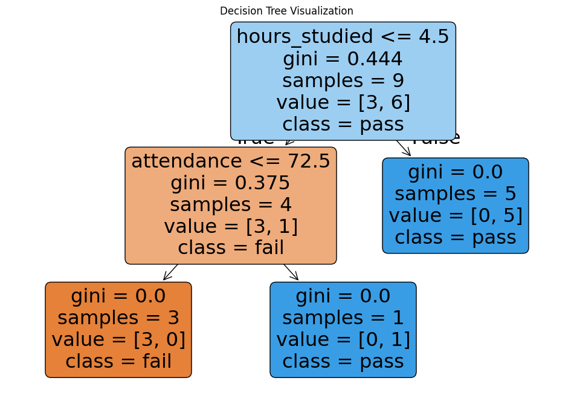

# Decision Tree

Decision trees are ideal when you need a model that is **highly interpretable**, 
requires minimal data preparation, and can handle both **numerical** and **categorical** data.

They excel for both **classification** (sorting into categories) and **regression** (predicting numerical values) tasks 
without needing complex feature scaling.

When to use:
- Clear Interpretability: You need to easily explain why a decision was made.
- Low Data Preparation: You want to avoid normalizing data, creating dummy variables, or removing blank values.
- Exploratory Data Analysis: You want to visualize the data rules to quickly identify the most important features or variables influencing your outcome.
- Simpler Datasets

When to avoid:
- High-variance Data
- Risk of Overfitting
- Continuous Linear Relationships: If your data follows a smooth, linear progression (e.g., standard linear price changes), linear regression models often perform much better and are less prone to overfitting

