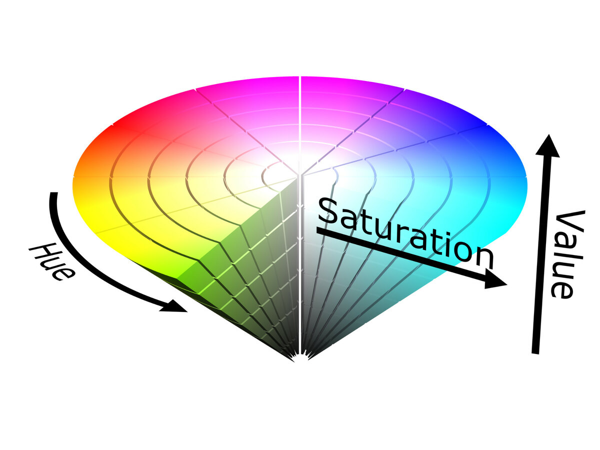

# Detecting Color in an Image Using HSV

Here we will see how to use the HSV color space to detect and isolate a specific color, in this case, red within an
image. The HSV color space is often preferred over the RGB color space for tasks like color detection because it
separates color (hue) from intensity (value). This makes it easier to define specific color ranges and perform
operations like color segmentation.

**cv2.cvtColor()** is an OpenCV function that converts an image from one color space to another.

